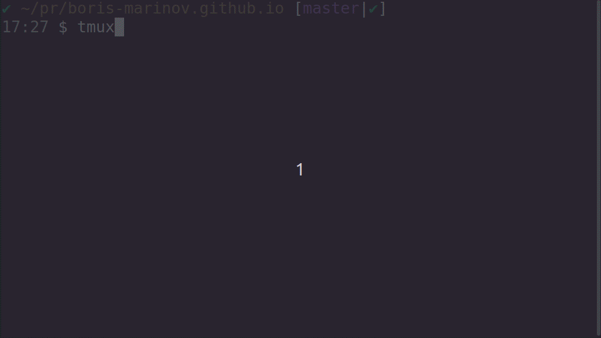
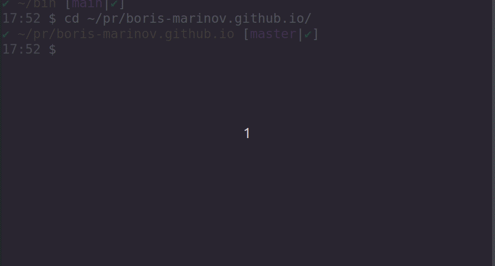

Some handy scripts that I use.

vim
===

`copy`
---
[Works only from tmux] - opens the current contents of the console in vim for the purpose of easy copying and pasting - a text screenshot, if you will. Also, it keeps an archive of all the things you copied in ~/.screengrabs

`rv <term>`
---
Searches for a word or a phrase in current dir, using `ripgrep` and opens all results in `vim` in separate tabs with the word highlighted. e.g. `rv <<<<` opens up all files with merge conflicts.

`fv`
---
Searches for a file using "fzf" and opens it in vim

`gv <git_revision = "HEAD~">`
---
Opens all the files that were changed in the given git revision. By default it is the last revision.

`note <note>`
---
Adds a new note to  ~/temp.md file directly from the console

`vt`
---
Just opens `~/temp.md` - a handy solution for keeping notes.

git
===

helpful git aliases.

`git-commit-branch <branch_name>`
---
Creates a new git branch with the name you pass and commits the current changes there. 

Usage: `git-commit-branch New-branch-name`

`git-push-branch <branch_name>`
---
Same but also pushes the changes.

`git-push-stuff`
---
Commits and push current changes with a predefined message.

`git-force-push`
---
An alias to git --force-with-lease that also checks checking whether you are on main/master

`git-graph`
---
Prints the git tree in the console.

`git-jump`
---
Opens all local branches, ordered by last commit using "fzf" and lets you chose one to checkout.

Lynx
===

Open websites from the command line.

`dd <term>`
---
Opens up the GoDuckGo search engine in the `lynx` CLI browser showing search results for a word that you pass. 

Usage: `dd test` opens search results for the word "test".

`wiki <term>`
---
Same but with Wikipedia

`dict <term>`
---
Same but with Merriam Webster dictionary.

